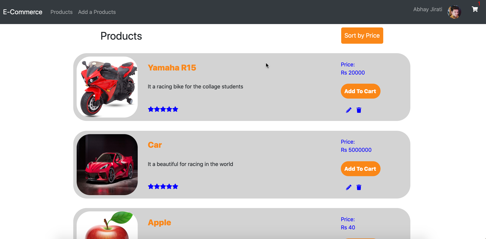
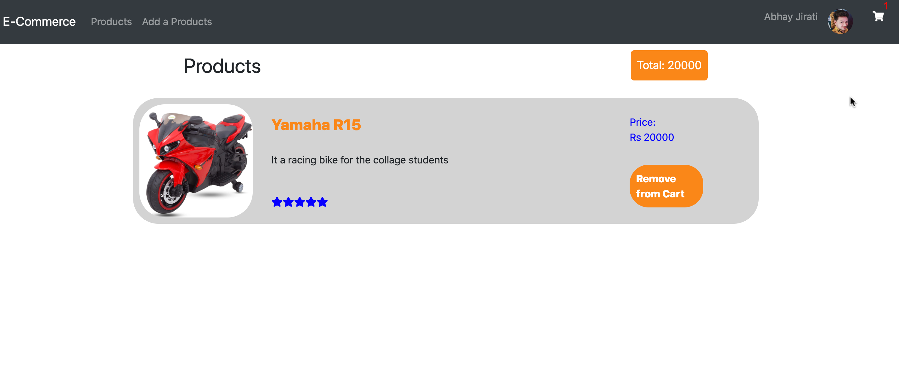
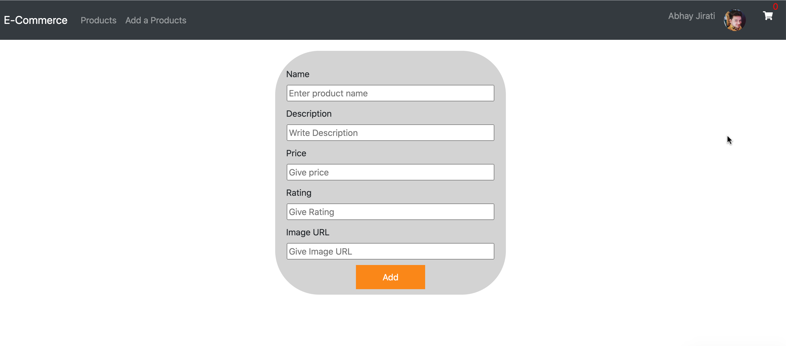

This project was bootstrapped with [Create React App](https://github.com/facebook/create-react-app).

# Go for the Preview
#

## ALL Product

## Cart Item 

## Add Product

## How can i install locally?
    1. First you need to have installed node js in your system.
    2. Then you need to clone the repo.
    3. Then open the repo in the editor.
    4. Then run the command.
    >> npm install
    5. Then run the server.
    >> npm start
    
## How it works?
    There  are many functionality in the project
    1. You can see the all products.
    2. You can see the cart item.
    3. You can see the cart Total.
    4. You can add the product to the products list by going to the add product button.
    5. You can add the product to the cart by clicking the add to cart button.
    6. You can remove the product from the cart by clicking the remove from the cart.
    7. You can edit the product details by clicking the pencil button.
    8. You can delete the product bu clicking the delete button.
    9. You can sort the product list by clicking the sort by price button.
    

## Available Scripts

In the project directory, you can run:

### `npm start`

Runs the app in the development mode. 
Open [http://localhost:3000](http://localhost:3000) to view it in the browser.

The page will reload if you make edits. 
You will also see any lint errors in the console.

### `npm test`

Launches the test runner in the interactive watch mode. 
See the section about [running tests](https://facebook.github.io/create-react-app/docs/running-tests) for more information.

### `npm run build`

Builds the app for production to the `build` folder. 
It correctly bundles React in production mode and optimizes the build for the best performance.

The build is minified and the filenames include the hashes. 
Your app is ready to be deployed!

See the section about [deployment](https://facebook.github.io/create-react-app/docs/deployment) for more information.

